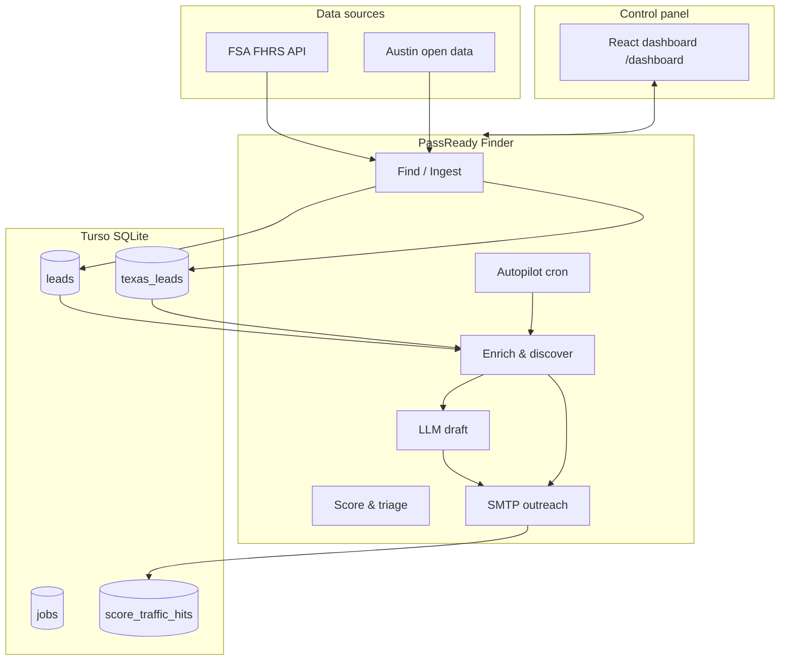

# PassReady Finder — Architecture & Features

**Repository:** [passreadyfinder](https://github.com/nick39257-resilient/passreadyfinder)  
**Production:** Render (`readyfinder.onrender.com`)  
**Product:** Outbound lead engine for **PassReady** — UK FSA takeaways and Texas health-inspection businesses.

This document describes the full system as implemented in the codebase (June 2026).

---

## Table of contents

1. [System overview](#1-system-overview)
2. [Repository layout](#2-repository-layout)
3. [Tech stack](#3-tech-stack)
4. [Deployment](#4-deployment)
5. [Data layer](#5-data-layer)
6. [UK pipeline](#6-uk-pipeline)
7. [Texas pipeline](#7-texas-pipeline)
8. [Job system](#8-job-system)
9. [REST API](#9-rest-api)
10. [Dashboard](#10-dashboard)
11. [External integrations](#11-external-integrations)
12. [Configuration](#12-configuration)
13. [Business rules](#13-business-rules)
14. [CLI reference](#14-cli-reference)

---

## 1. System overview

PassReady Finder automates **finding, enriching, scoring, drafting, and sending** outreach to food businesses that may benefit from PassReady compliance tooling.

Two regional pipelines share one database and one web service:

| Region | Data source | Primary table | SafeScore URL |
|--------|-------------|---------------|---------------|
| **UK** | FSA Food Hygiene Rating Scheme (FHRS) API | `leads` | `https://score.passready.uk` |
| **Texas** | Austin/Travis open-data inspections (Socrata) | `texas_leads` | `https://score.passready.us` |

High-level flow:



**Relationship to main PassReady app:** Finder is a **standalone** outbound engine. It does not implement kitchen illness logs, the 48-hour return rule, or multi-language EHO agent features — those live in the main PassReady product.

---

## 2. Repository layout

```
passreadyfinder/
├── src/
│   ├── server/           # Express app, routes, job runner
│   ├── engine/           # Core pipelines (find, enrich, send, Texas, UK)
│   ├── cli/              # npm script entry points
│   ├── config/           # product.config.ts, score-urls.ts
│   └── types/
├── dashboard/            # React 19 + Vite control panel
│   └── src/
│       ├── components/   # UK App, TexasCommandCenter, shared widgets
│       └── api/          # Frontend fetch clients
├── public/               # Legacy static HTML (control.html, review.html)
├── scripts/              # Build helpers, Playwright install, smoke tests
├── api/index.ts          # Vercel serverless handler (legacy)
├── render.yaml           # Render Blueprint (primary deploy)
└── docs/                 # This file
```

Not a formal npm workspaces monorepo — one root `package.json` plus a nested `dashboard/package.json`.

---

## 3. Tech stack

| Layer | Technology |
|-------|------------|
| Runtime | Node.js 20, ESM, TypeScript (`tsx`) |
| HTTP server | Express 5 |
| Database | Turso / libSQL (`@libsql/client`); local SQLite via `TURSO_LOCAL_PATH` |
| Dashboard | React 19, Vite 6, Tailwind CSS 4 |
| LLM drafts | OpenAI-compatible API → **Gemini** (`OPENAI_BASE_URL`, `GEMINI_DRAFT_MODEL`) |
| Outbound email | Namecheap Private Email via **nodemailer** (SMTP) |
| Inbound email | Resend webhook (`POST /api/webhooks/resend`) |
| Browser automation | Playwright (optional) — contact forms, Texas autopilot |
| Web discovery | DuckDuckGo HTML/Lite/API + Mojeek fallback |
| Owner email lookup | Apollo.io `people/match` |
| Validation | Zod |

---

## 4. Deployment

### Render (production)

Defined in `render.yaml`:

| Service | Type | Schedule / command | Purpose |
|---------|------|-------------------|---------|
| `passreadyfinder` | Web | `npm start` → `tsx src/server/app.ts` | API + dashboard at `/dashboard/` |
| `passreadyfinder-find` | Cron | `0 3 * * *` → `npm run find-cron` | Daily UK FSA batched find |
| `passreadyfinder-queue-draft` | Cron | `*/30 * * * *` → `npm run queue-draft` | Draft 2 leads per run |
| `passreadyfinder-send` | Cron | `5,20,35,50 13,14 * * *` → `npm run send-cron` | UK 2pm send window |
| `texas-autopilot-cron` | Cron | `0 */12 * * *` → Playwright + `texas-autopilot` | Texas discovery/forms |
| `uk-autopilot-cron` | Cron | `30 */12 * * *` → Playwright + `uk-autopilot` | UK discovery (forms off) |

**Build:** `npm install && npm install --prefix dashboard && npm run build`  
**Health check:** `GET /health`  
**Memory:** Cron jobs use `NODE_OPTIONS=--max-old-space-size=448` (512MB plan).

Playwright Chromium is installed at build time via `scripts/ensure-playwright-chromium.mjs` with `PLAYWRIGHT_BROWSERS_PATH=0`.

### Vercel (legacy)

`api/index.ts` exports the Express app with `serveStatic: false`. README still mentions Vercel; Render is the active Blueprint.

### Local dev

```bash
cp .env.example .env
npm install
npm run dashboard:dev    # Vite dev server (proxies API)
# or
npm run review           # Full server at http://localhost:3000
```

---

## 5. Data layer

**Client:** `src/engine/store/db.ts`  
**Migrations:** Run on server startup via `runMigrations()`.

### Core tables

#### `leads` (UK)

FSA establishments plus outreach state.

| Column group | Examples |
|--------------|----------|
| Identity | `fsa_id`, `business_name`, `business_type`, `address`, `postcode`, `lat`, `lng` |
| FSA | `fsa_rating`, `fsa_last_inspection_date`, sub-scores |
| Contact | `phone`, `website`, `email` |
| Scoring | `lead_score`, `on_delivery_app` |
| Outreach | `status`, `draft_message`, `touch_count`, `contacted_at`, `replied_at`, `opted_in_at` |
| Enrichment | `enrichment_status`, `apollo_enriched_at`, `contact_form_submitted_at` |
| Review | `flag_for_review`, `needs_eyes_reason`, `last_previewed_at` |
| Compliance | `unsubscribe_token`, `local_authority_name` |

#### `texas_leads` (Texas)

Open-data inspections plus HB 2844 mobile classification.

| Column group | Examples |
|--------------|----------|
| Identity | `external_id`, `source`, `business_name`, address fields |
| Inspection | `inspection_score`, `demerits`, `risk_score`, `intervention_level` |
| HB 2844 | `is_mobile_vendor`, `vendor_tier`, `vehicle_type`, `dshs_license_status` |
| Contact | `phone`, `email`, `owner_name`, `website`, `contact_form_page_url` |
| Outreach | `status`, `draft_message`, `outreach_sent_at`, `apollo_enriched_at` |

#### `jobs`

Background work queue: `id`, `type`, `status` (`pending` \| `running` \| `done` \| `failed`), `progress`, `result`, `error`, `params`, timestamps.

#### `score_traffic_hits`

SafeScore pixel attribution: `site` (`uk` \| `us`), optional `rid` (lead id), `created_at`.

#### Other tables

| Table | Purpose |
|-------|---------|
| `osm_cache` | Overpass lookup cache per `fsa_id` |
| `lead_contact_discovery` | Multi-channel contact data per UK lead |
| `email_drafts` | Draft approval workflow |
| `suppression_list` | Unsubscribes / bounces |
| `email_events` | Deliverability tracking |
| `outreach_settings` | e.g. `last_send_day_uk` |
| `send_confirm_tokens` | One-time send confirmation (5 min TTL) |
| `texas_outreach_templates` | HB 2844 mobile pitch templates |
| `engine_logs` | System activity log |

---

## 6. UK pipeline

### 6.1 Find & score

1. **FSA FHRS API** — paginate `/Establishments` by business type (`src/engine/finder/fsa-finder.ts`).
2. **Targets** (`product.config.ts`): Takeaway/sandwich shop, Restaurant/Cafe/Canteen, Mobile caterer; `maxRating: 4`.
3. **Scoring** (`src/engine/score/scorer.ts`) — rating points, inspection age, delivery-app bonus.
4. **Guardrails** (`src/engine/lead-guardrails.ts`) — venue quality filters.
5. **Delta sync** — only re-process when `RatingDate` changes.

**Cron:** `find-cron.ts` scans authorities in batches (`FIND_CRON_AUTHORITY_BATCH=20`), enriches top 15 (`FIND_CRON_ENRICH_TOP_N=15`).

### 6.2 Enrichment

| Step | Source | File |
|------|--------|------|
| Phone / website | OpenStreetMap Overpass (150m radius) | `osm-enricher.ts` |
| Email from website | Crawl + regex | `email-from-website.ts`, `website-email-scraper.ts` |
| Owner email | Apollo.io | `apollo-service.ts` |
| Contact routes | OSM → `/contact`, `/about` → email/phone/social/WhatsApp | `contact-discovery/discover.ts` |

### 6.3 Drafting

- **QueueDrafter** (`queue-drafter.ts`) — Gemini drafts for `status = 'new'`, risk ≥ 75, batch of 2, 60–120s between leads.
- **Quick draft** — per-lead from dashboard (`quick-draft-handler.ts`).
- **4-touch sequence** (`outreach-sequence-meta.ts`) — max 4 emails; SafeScore link rules in `outreach-landing-url.ts`.

### 6.4 Sending

- **SMTP** via `smtp-mail-service.ts` / `sender.ts`.
- **UK send window:** 2pm local (`send-schedule.ts`); cron checks hourly during 13:00–14:59 UTC slots.
- **Daily cap:** 30 (configurable via `DAILY_SEND_CAP`).
- **Confirm token** required before bulk send (`POST /api/jobs/send`).
- **Deliverability pause** if bounce rate > 2%.

### 6.5 UK autopilot

`src/engine/uk/uk-autonomous-outreach.ts`:

1. Queue: leads without email, not halted (`leads-autopilot-repository.ts`).
2. OSM website → DuckDuckGo search → email scrape.
3. Optional Playwright contact form (disabled on cron: `UK_AUTOPILOT_CONTACT_FORMS=false`).
4. Hardcoded score URL: `https://score.passready.uk` (`score-urls.ts`).

**Trigger:** `POST /api/uk/jobs/autopilot` or `npm run uk-autopilot`.

### 6.6 UK lead lifecycle

```
new → drafted → approved (postbox) → contacted → replied / opted_in / nurture / suppressed
```

Dashboard filters: all, changed, needs_eyes, approved, sent, replies, call, whatsapp, contactable, new, drafted, high.

---

## 7. Texas pipeline

### 7.1 Ingest

- **Source:** Austin/Travis Socrata JSON (`product.texas.config.ts` → `data.austintexas.gov`).
- **Service:** `texasIngestionService.ts` maps records → `TexasLeadInput`.
- **Job:** `find_texas` via `find-texas-leads-job.ts`.
- **Trigger:** Dashboard ingest button, `POST /api/texas/jobs/find`, or autopilot when DB is empty.

### 7.2 Risk scoring & HB 2844

- **Risk score** (`texas-risk-score.ts`) — `intervention_level`; CRITICAL at ≥ 79.
- **HB 2844** (`hb2844.ts`) — mobile vendor detection, tier (TYPE_I / II / III).
- **Effective date:** `2026-07-01` in config.
- **Mobile pitch:** auto-generated `draft_message` from `HB2844_MOBILE_PITCH_TEMPLATE`.
- **Reclassify:** `texas_reclassify` job → `find-texas-tier-resync-job.ts`.

### 7.3 Apollo enrichment

- `texas-enrichment-service.ts` + CLI `npm run texas-enrich-apollo`.
- Batch for leads missing email; ordered by risk score; credit caps in config.
- **Trigger:** `POST /api/texas/jobs/enrich-apollo` (background).

### 7.4 Texas autopilot

`src/engine/texas/texas-autonomous-outreach.ts`:

1. Queue: `texas_leads` without email, status in `new` / `ready_to_review`, not already sent (`texas-leads-repository.ts`).
2. DuckDuckGo website discovery → email scrape → Playwright contact form.
3. HB 2844 pitch with tracked SafeScore URL (`buildTrackedLandingUrl` + `score.passready.us`).
4. Cron: every 12h, limit 8, delay 1500ms.

**Trigger:** `POST /api/texas/jobs/autopilot` or `npm run texas-autopilot`.

**Autopilot kickoff (502 fix):** Endpoints return `200` immediately; jobs start via `deferStartJob()` in `autopilot-kickoff.ts`. If `texas_leads` count is 0, autopilot starts `find_texas` ingest instead.

### 7.5 Texas outreach

| Channel | When | Executor |
|---------|------|----------|
| Email | Email on file (Apollo or scrape) | `texas-outreach-executor.ts` → SMTP |
| Contact form | Website, no email | Playwright via `texas-contact-form-autopilot.ts` |
| Manual | Maps / social | `texas-multi-channel.ts` (dashboard links) |

**Complete statuses:** `EMAIL_SENT`, `FORM_SUBMITTED`.

---

## 8. Job system

### Job types

Defined in `src/engine/store/jobs-repository.ts`:

| Type | Description |
|------|-------------|
| `find` | UK FSA find job |
| `find_texas` | Texas open-data ingest |
| `texas_reclassify` | HB 2844 tier resync |
| `texas_autopilot` | Texas discovery + forms batch |
| `uk_autopilot` | UK discovery + forms batch |
| `draft` | Draft single lead |
| `draft_all` | Auto-draft all eligible |
| `send` | SMTP send approved leads |
| `quick_draft` | Dashboard quick draft |
| `contact_discovery` | UK contact route discovery |

### Execution

- **`startJob()`** (`job-runner.ts`) — fire-and-forget async; per-type timeouts (e.g. `texas_autopilot` 55 min).
- **`deferStartJob()`** (`autopilot-kickoff.ts`) — `setImmediate()` so HTTP responds before Playwright starts.
- **Stale reclaim** (`job-stale-reclaim.ts`) — orphaned `pending`/`running` jobs reclaimed on startup and via `POST /api/jobs/reset-stuck`.
- **Polling:** `GET /api/jobs/:id` — dashboard uses `pollJobUntilDone()`.

### Autopilot kickoff response shape

```json
{
  "success": true,
  "message": "Autopilot run started in background (12 lead(s) in discovery queue).",
  "jobId": "uuid",
  "queueSize": 12,
  "ingestStarted": false,
  "jobs": [{ "type": "texas_autopilot", "jobId": "uuid" }]
}
```

---

## 9. REST API

Base URL: production web service root. Dashboard uses relative paths (`/api/...`).

### Health & config

| Method | Path | Auth | Description |
|--------|------|------|-------------|
| GET | `/health` | — | Liveness |
| GET | `/api/config` | — | `{ requiresControlSecret, outreachLandingUrl }` |

### UK leads

| Method | Path | Description |
|--------|------|-------------|
| GET | `/api/leads` | List leads (filters via query) |
| GET | `/api/leads/:id` | Lead detail |
| POST | `/api/leads/:id/stop-sequence` | Halt email sequence |
| POST | `/api/leads/:id/mark-converted` | Mark converted |
| POST | `/api/leads/:id/mark-not-interested` | Mark not interested |
| POST | `/api/leads/:id/mark-visited` | Mark visited |
| POST | `/api/leads/:id/set-email` | Set outreach email |
| POST | `/api/leads/:id/flag-review` | Flag for human review |
| POST | `/api/leads/:id/discover-contacts` | Start contact discovery job |
| PATCH | `/api/leads/:id/contact-discovery` | Update discovery record |
| POST | `/api/leads/:id/quick-draft` | Generate draft |
| POST | `/api/leads/:id/postbox` | Queue to postbox |

### Drafts & send

| Method | Path | Description |
|--------|------|-------------|
| GET | `/api/drafts` | Pending drafts |
| POST | `/api/drafts/:id/approve` | Approve draft |
| POST | `/api/drafts/:id/reject` | Reject draft |
| GET | `/api/send/preview` | Send preview + confirm token |
| POST | `/api/jobs/send` | Execute send (requires token) |

### Stats & intelligence

| Method | Path | Description |
|--------|------|-------------|
| GET | `/api/stats` | Lead counts |
| GET | `/api/funnel` | Outreach funnel |
| GET | `/api/activity` | Recent activity |
| GET | `/api/status` | System pulse |
| GET | `/api/deliverability` | Bounce / pause state |
| GET | `/api/fsa/authorities` | UK authority list |
| GET | `/api/sync/status` | FSA sync status |

### Jobs

| Method | Path | Description |
|--------|------|-------------|
| GET | `/api/jobs/:id` | Job status + progress |
| POST | `/api/jobs/find` | Start UK find |
| POST | `/api/jobs/draft` | Start draft job |
| POST | `/api/jobs/draft-all` | Auto-draft all |
| POST | `/api/jobs/reset-stuck` | Reclaim stuck jobs |
| POST | `/api/jobs/triage` | Run lead triage |

### UK autopilot (`uk-routes.ts`)

| Method | Path | Description |
|--------|------|-------------|
| GET | `/api/uk/status` | Last run, engine status, forms submitted |
| POST | `/api/uk/jobs/autopilot` | Start UK autopilot (200, background) |

### Texas (`texas-routes.ts`)

| Method | Path | Description |
|--------|------|-------------|
| GET | `/api/texas/status` | Autopilot heartbeat metadata |
| GET | `/api/texas/stats` | Lead counts by segment |
| GET | `/api/texas/leads` | List (`segment=all\|mobile\|hasEmail`) |
| GET | `/api/texas/leads/:id` | Lead detail |
| POST | `/api/texas/leads/:id/send-outreach` | Send email or form for one lead |
| POST | `/api/texas/jobs/autopilot` | Start autopilot (200, background) |
| POST | `/api/texas/jobs/enrich-apollo` | Apollo batch (200, background) |
| POST | `/api/texas/jobs/reclassify` | HB 2844 resync (200, background) |
| POST | `/api/texas/jobs/find` | Ingest open data (200, background) |

### SafeScore traffic (`score-traffic-routes.ts`)

| Method | Path | Description |
|--------|------|-------------|
| GET | `/api/score-traffic/pixel.gif?site=uk\|us&rid=` | Tracking pixel |
| POST | `/api/score-traffic/hit` | Manual hit log |
| GET | `/api/score-traffic/stats` | Hit counts for dashboard |

### Webhooks & compliance

| Method | Path | Description |
|--------|------|-------------|
| POST | `/api/webhooks/resend` | Inbound email (Resend) |
| GET | `/api/outreach/unsubscribe?token=` | One-click unsubscribe |

### Static routes

| Path | Serves |
|------|--------|
| `/` | Redirect → `/dashboard/` |
| `/dashboard/*` | React SPA (`dashboard/dist/`) |
| `/control`, `/review` | Legacy HTML in `public/` |

### Authentication

`requireControlAuth` in `createApp.ts` is currently a **no-op** (always calls `next()`). The dashboard still sends `Authorization: Bearer <secret>` from session storage, but the server does not enforce `CONTROL_PANEL_SECRET`. `/api/config` returns `requiresControlSecret: false`.

---

## 10. Dashboard

**URL:** `/dashboard/` (UK), `/dashboard/texas` (Texas).

Built with React 19 + Vite; Tailwind for styling. Off-white backgrounds, high-contrast body text, 48×48px minimum tap targets for kitchen/glove use (aligned with PassReady design rules).

### UK Command Center (`dashboard/src/App.tsx`)

| Feature | Component / behavior |
|---------|---------------------|
| Lead radar | Filters, swipe gestures, `LeadRow`, `LeadDetailDrawer` |
| Outreach | `OutreachSequencePanel`, `OutreachScoreFunnel` |
| Find | `FindAreaModal` → `POST /api/jobs/find` |
| Actions | `FixedActionBar` — Find / Auto-draft all / Send |
| Status | `PostboxStatus`, `SystemPulse`, `AutopilotHeartbeat` |
| Mobile trigger | `MobileAutopilotTrigger` mode=`uk` |
| Traffic | `ScoreTrafficCounter` |

### Texas Command Center (`TexasCommandCenter.tsx`)

| Feature | Component / behavior |
|---------|---------------------|
| Filters | All records / Mobile (HB 2844) / Has email |
| Cards | `TexasLeadCard`, detail drawer |
| Outreach | `TexasOutreachPanel`, `TexasContactOptions` |
| Ingest | Button → `POST /api/texas/jobs/find` |
| Autopilot | `MobileAutopilotTrigger` mode=`texas` |
| Status | `AutopilotHeartbeat`, `TexasOutreachScoreFunnel`, `ScoreTrafficCounter` |

### Shared components

- `MobileAutopilotTrigger` — instant 200 kickoff, background job polling
- `AutopilotHeartbeat` — engine idle/processing, last run time
- `ScoreTrafficCounter` — polls `/api/score-traffic/stats`
- `DraftPreviewBlock`, `ActionBanner`, `ErrorBoundary`

### MobileAutopilotTrigger behavior

1. POST autopilot endpoint (fast).
2. Show server `message` immediately (no gateway timeout).
3. Poll `GET /api/jobs/:id` in background for progress.
4. `onRunComplete` refreshes stats and lead list.

---

## 11. External integrations

| Service | Role | Key files |
|---------|------|-----------|
| **FSA FHRS** | UK establishment + rating data | `fsa-finder.ts`, `fsa-detail.ts` |
| **Overpass / OSM** | Phone, website near coordinates | `osm-enricher.ts` |
| **DuckDuckGo** | Website discovery (HTML, Lite, API) | `web-search-discovery.ts` |
| **Mojeek** | Search fallback | `web-search-discovery.ts` |
| **Apollo.io** | Owner email (`people/match`) | `apollo-service.ts` |
| **Playwright** | Contact form submission | `playwright-browser.ts`, `contact-form-service.ts` |
| **Gemini** | Outreach draft generation | `drafter.ts`, `queue-drafter.ts` |
| **SMTP (Namecheap)** | Outbound email | `smtp-mail-service.ts` |
| **Resend** | Inbound webhook only | `resend-inbound-webhook.ts` |
| **Austin open data** | Texas inspection ingest | `texasIngestionService.ts` |

---

## 12. Configuration

### Product config files

| File | Contents |
|------|----------|
| `src/config/product.config.ts` | UK business types, scoring, FSA/OSM, outreach delays, send caps, pitch guidelines |
| `src/config/product.texas.config.ts` | HB 2844 date, Austin URL, Apollo/autopilot limits, Texas outreach copy |
| `src/config/score-urls.ts` | Hardcoded autopilot SafeScore URLs (not env-overridable) |

### Score URLs

| Context | URL | Config |
|---------|-----|--------|
| UK autopilot | `https://score.passready.uk` | `score-urls.ts` |
| Texas autopilot | `https://score.passready.us` | `score-urls.ts` |
| UK manual outreach CTA | `TRIAL_URL` / `SCORE_URL` env | `outreach-landing-url.ts` |
| Attribution | `?rid=` on pixel and links | UK: `fsa_id`; Texas: `texas_leads.id` |

### Environment variables (summary)

See `.env.example` for the full list.

| Group | Variables |
|-------|-----------|
| Database | `TURSO_DATABASE_URL`, `TURSO_AUTH_TOKEN`, `TURSO_LOCAL_PATH` |
| LLM | `OPENAI_API_KEY`, `OPENAI_BASE_URL`, `GEMINI_DRAFT_MODEL` |
| Email | `EMAIL_USER`, `EMAIL_PASS`, `EMAIL_HOST`, `EMAIL_PORT` |
| Outreach | `WHATSAPP_NUMBER`, `TRIAL_URL`, `SCORE_URL`, `DAILY_SEND_CAP`, `PUBLIC_APP_URL` |
| Apollo | `APOLLO_API_KEY`, `APOLLO_DAILY_CAP`, `APOLLO_SUCCESSFUL_FIND_CAP` |
| Texas | `TEXAS_AUSTIN_INSPECTIONS_URL`, `TEXAS_AUTOPILOT_*`, `TEXAS_APOLLO_*` |
| UK autopilot | `UK_AUTOPILOT_LIMIT`, `UK_AUTOPILOT_DELAY_MS`, `UK_AUTOPILOT_CONTACT_FORMS` |
| Playwright | `PLAYWRIGHT_BROWSERS_PATH` |
| Traffic | `SCORE_TRAFFIC_SECRET` |
| Security | `CONTROL_PANEL_SECRET` (documented; not enforced server-side) |
| Cron tuning | `FIND_CRON_AUTHORITY_BATCH`, `FIND_CRON_ENRICH_TOP_N`, `NODE_OPTIONS` |

---

## 13. Business rules

### UK display policy (`lead-display-policy.ts`)

- Show takeaways ≤ 4★ with email, phone, or website.
- Leads already in outbound statuses stay visible even if they no longer match find filters.

### UK outreach

- **Primary channel:** email (SMTP).
- **Secondary:** WhatsApp, contact form (Playwright), phone scripts from contact discovery.
- **4-touch sequence**; halted when `suppressed`, `replied`, `opted_in`, `trial_started`, `nurture`, `form_submitted`.
- **First touch:** SafeScore link only; no shaming about star ratings (`pitchGuidelines`).
- **Postbox:** requires valid business email (`isValidOutreachEmail`).
- **QueueDrafter:** `status = 'new'`, risk ≥ 75, not suppressed.

### Texas outreach

- Email if address on file; else contact form if website exists.
- Mobile vendors get HB 2844 draft on ingest.
- Critical intervention at risk score ≥ 79.
- Empty DB + autopilot trigger → auto-start `find_texas` ingest.

### SafeScore traffic

- Pixel `GET /api/score-traffic/pixel.gif?site=uk|us&rid=...` logs to `score_traffic_hits`.
- UK preview sets `last_previewed_at` and `flag_for_review` (`LIVE_SCORE_PREVIEW`).

### Lead triage (`lead-triage.ts`)

Post-send: flags needs-eyes, routes WhatsApp, moves to nurture.

### Not in this repo

- 48-hour illness / vomiting / diarrhoea return rule (main PassReady app).
- Officer Sarah Mitchell / multi-language EHO agent (main PassReady app).

---

## 14. CLI reference

| npm script | Entry | Description |
|------------|-------|-------------|
| `npm run find` | `find-leads.ts find` | Full UK FSA pipeline |
| `npm run find-cron` | `find-cron.ts` | Daily batched find (Render) |
| `npm run list` | `find-leads.ts list` | Print top leads |
| `npm run draft` | `draft.ts` | LLM draft top N |
| `npm run queue-draft` | `queue-draft.ts` | QueueDrafter batch |
| `npm run send` | `send.ts` | Send approved leads |
| `npm run send-cron` | `send-cron.ts` | UK 2pm window sender |
| `npm run enrich` | `enricher.ts` | OSM enrichment |
| `npm run enrich-emails` | `enrich-emails.ts` | Website email scrape |
| `npm run enrich-phase1` | `enrich-phase1.ts` | Apollo + contact forms |
| `npm run uk-autopilot` | `uk-autopilot.ts` | UK discovery/forms |
| `npm run texas-autopilot` | `texas-autopilot.ts` | Texas discovery/forms |
| `npm run texas-enrich-apollo` | `texas-enrich-apollo.ts` | Texas Apollo batch |
| `npm run texas-reclassify` | `texas-reclassify.ts` | HB 2844 tier resync |
| `npm run diagnose` | `diagnose-outreach.ts` | Outreach diagnostics |
| `npm run triage` | `triage-leads.ts` | Lead triage |
| `npm run call-list` | `call-list.ts` | Call list export |
| `npm run build` | typecheck + dashboard build | Production build |
| `npm start` | `server/app.ts` | Production server |

---

## Appendix: Known documentation gaps

| Topic | Note |
|-------|------|
| README | Still mentions Resend for sending and Vercel as primary deploy; production uses SMTP + Render. |
| Auth | `CONTROL_PANEL_SECRET` documented in `.env.example` but not enforced on API routes. |
| PassReady app | Finder is separate from the main PassReady compliance product. |

---

*Last updated: June 2026 — commit `1b46034` (background autopilot kickoff).*
